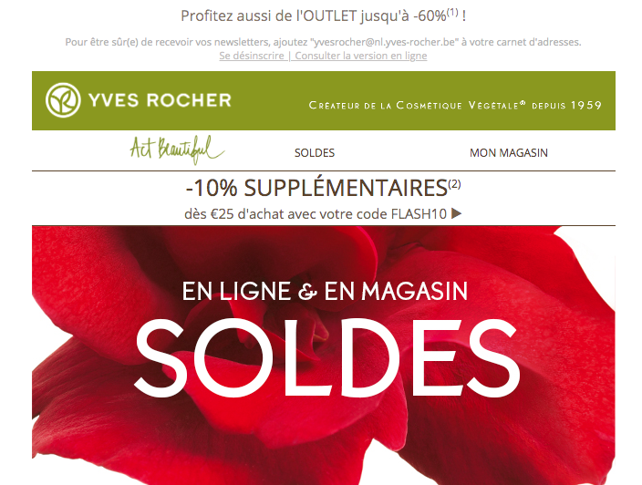
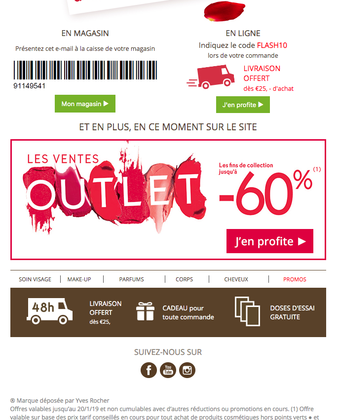

# Réalisation d'une newsletter "Yves Rocher"
### But du projet :

* Utiliser les tableaux en HTML
* Savoir reproduire une maquette
* Respecter le style imposé (la charte graphique) par un client

### Voir le résultat : [cliquez-ici](https://ho-be-one.github.io/newsletter/)

